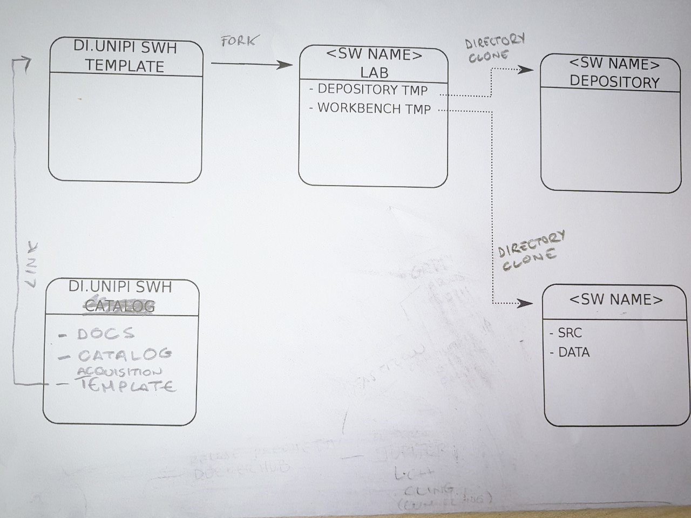

*[google doc precedente](https://docs.google.com/document/d/1oHqEwyZscRNWgcktnLXohNuNWvYM2fwCsuBHtYNH9FM/edit?usp=sharing)*

## The Process 

**The Software Heritage Acquisition Process (SWHAP)** is build of the following steps:

* collect
* curate
* present

To realize the process we use the following components:

* the depository
* the workbench
* the vault

The final product of the process is the **curated source code (CuratedSC)** that will be stored into the vault, that is the Software Heritage Archive.
Both the depository and the workbench are introduced to being able of tracing the origin and the evolution of the artifacts leading to the CuratedSC.
In the end we must be able to answer the questions "What we have ?", "Where and when we found it ?", "In what way has been archived and transformed" ?  

After being either pulled or pushed, the software is Collected from an origin, and stored in its digital copy into the depository.
The origin, in the case of phisical reportories, can be a phisical place, we speak of warehouse. From the warehouse a digital "as is" copy is made into the dopository.

Both the depository and the workbench have :

* a Catalogue, that is, similar to a library catalogue, a complete list of items, typically one in alphabetical or other systematic order;
* a Journal, that is, a registry where all the done operations are written. For the depository and the warehouse the journal contains records for acquisitions, their date, notes about the origin of the artifacts, information about where they are archived. For the workbench the journal is more detailed: is a sort of lab notebook where every activity is tracked.

## The Instantiation of the process: the di.unipi case

We focus our attention to the following legacy software:

* **CMM** - A garbage collector written by Giuseppe Attardi and Tito Flagella
* Grossi Tarabella musica elettronica<!-- TODO: Titolo  -->

* Martelli Montanari
* Macchina ridotta
* Compilatore fortran cep
* Index Dantesco di Padre Busa
* Programma primo Ping di Lenzini
* Parser di linguistica computazionale

To acquire legacy softwares of Department of Computer Science at the University of Pisa, we instantiated the model of SWHAP using GitHub as support.

In particular, we choose GitHub as material implementation of the depository and of the workbench as : 

* it is a well established platform for storing open source project and for collaborate with others. It offers an extensive and reachable disk space at a convenient price - it is free for open source projects;
* at the moment, the Software Heritage has already a crawler that feed the vault from GitHub

The process here is as follows:
1. For ecvery new software acquisition, the DI.UNIPI SWH TEMPLATE is forked. 
   The forked repository is named with a 
   <!-- TODO: Finire -->