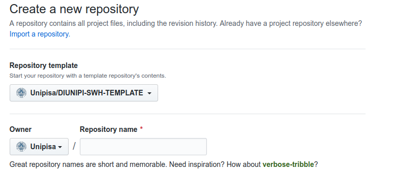
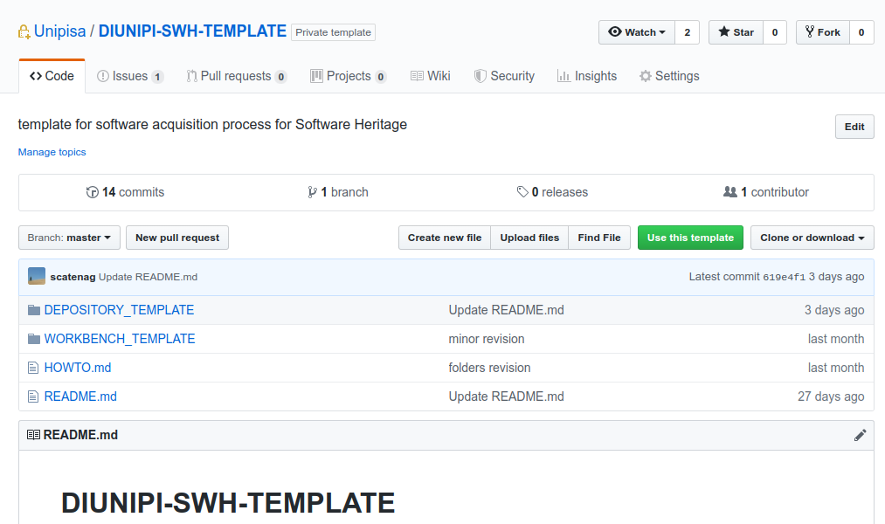
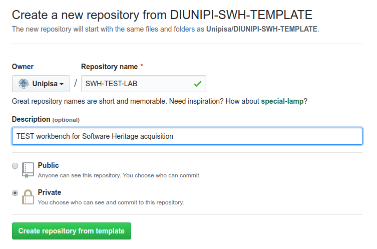

# The SWHAP@DIUNIPI.IT

Here we present the SoftwareHeritageAcquisitionProcess (SWHAPv0.1) we elaborated to acquire software at the Department of Computer Science of University of Pisa.
It should be considered as v0.1 (its first version): revisions and extension will surely come as the topic is broad and somehow sprawling and tentacular.

What follows is organized with the intent to distinguish the design of the logical process from the instantiation of such a process.
In fact, acquiring some case studies software we aim at defining an operational model and a possible implementation.
this physical storage place
## The Process

**The Software Heritage Acquisition Process (SWHAP)** is the process of acquisition of software source code from a request (*push* acquisition) or from a discover (*pull* acquisition).

To acquire software, we consider *source code* - rather than executables, for its value in terms of readability and understanding of the operation of the system - possibly with its *version history* - as an analogous of the strata of an archeological site, providing insights on the development process of the software.

The process is build of the following steps:

* **Collect**:
  the activities in which the material is recognized, digitally acquired when needed and cataloged. This process may be particularly hard and costly when the original software is not already accessible in digital form: it may involve the discovery of the coding scheme of the stored information and the recovery, may be even the building anew of the reading device, when the source code is stored on obsolete data supports.
* **Curate**:
  the activities of restoring, refining, correcting, integrating and reshaping into standard forms of materials, in such a way that they can be easily accessed and consulted. In particular, a work of identifying the different versions of a software, with their authors, is required.
* **Present**:
  the activities of organizing the collected and refined data for their presentation to the large public. 
  
  In particular, apart from the submission to the Software Heritage Archive (that is the primary goal of the project, that is, to preserve the software base), many different supports may be needed for different purposes.
  For instance, Wikidata/Wikipedia, to preserve the related historical information in a machine-accessible way, for further generic dissemination of the knowledge embedded in the software.
  Open Access repositories can be used for articles, books, technical reports. Presentation tools/mechanisms, to provide the relevant information available in the previous archives in a way tailored to specific situations, like public events, lectures, etc. A good example is the work that has been done for [Science Stories](http://sciencestories.io).

Each part of the process can be done by different people with different technical and cultural knowledge.
The artifacts resulting at the end of each step are somehow milestones and represents a goal.
When someone reaches a milestone, the administrator of the project and other users should be able to know that.

To realize the process go through three phases; each phase correspond to a virtual place and it is equipped with:

* a **Catalogue**, similar to a library catalogue, is a complete list of items, typically one in alphabetical or other systematic order;
* a **Journal**, that is a registry where all the done operations are written. For the depository and the warehouse, the journal contains records for acquisitions, their date, notes about the origin of the artifacts, information about where they are archived. For the workbench the journal is more detailed: is a sort of lab notebook where every activity is tracked.

In particular, the stages of the process are supported by the following resources:
 
* **Warehouse**
when the acquisition concerns physical items they are immediately stored in this physical storage place, where they are maintained thereafter

* **Depository**:
  it is a collection of raw (digital) material: there may be cases where it is needed to recover the digital representation from printouts of a software system, blueprints of a system architecture, punched cards, floppy disks, etc.
   
* **Workbench**: 
* **Vault**:

The final product of the process is the **curated source code (CuratedSC)** that will be stored into the Vault, that is the Software Heritage Archive ([HAL](https://hal.archives-ouvertes.fr/)).
Both the depository and the workbench are introduced to be able to trace the origin and the evolution of the artifacts leading to the CuratedSC.
In the end, we must be able to answer the questions *"What we have ?"*, *"Where and when we found it ?"*, *"In which way an item has been archived and transformed?"*.  
After being either pulled or pushed, the software is Collected from an *Origin*, and stored in its digital copy into the Depository.
The origin, in the case of physical repositories, can be a physical place, we speak of a warehouse. From the warehouse, a digital "as is" copy is made into the depository.

## Process instantiation: SWHAP@DIUNIPI.IT

To acquire the legacy software of the Department of Computer Science at the University of Pisa, we instantiated SWHAP using GitHub as support.

Nowadays, major technology companies (Google, Facebook, Twitter etc) and many Open Source software foundations (Apache Foundation, Linux Kernel etc) host their open source project to GitHub, and actually GitHub has become by far the most popular place to host open source code on the web.
A CVS is suited for multiple users operation like tha acquisition process we describe as anyone can develop, curate, perform correction and integrations and then use the pull-request feature to submit those changes to the project's maintainers.
<!--; otherwise these steps need to be done with sorts of submission by email and integrate changes manually.-->
Moreover, GitHub offers extensive free disk space for open source projects, it is already integrated with the SoftwareHeritage crawler. thus realizing reliable preservation and convergence to on-line SC process.
<!--Finally GitHub offers facilities to compile the journal (in the form of commit history, where each change is tracked), the catalogue, some usefull collaboration and presentation and analisys tools.-->

In particular, we choose GitHub as main implementation support, both for the depository and the workbench as

* it is a well-established platform to store open source projects with multi-partners collaboration. It offers an extensive and reachable disk space at a convenient price - free for open source projects;
* at the moment, Software Heritage has already a crawler that feeds the Vault from GitHub - we have an instantaneous realization of redundancy for persistence and convergence to the on-line software code acquisition process.;
* it offers facilities to compile the journal (in the form of commit history, where each change is tracked) and the catalogue;
* it offers collaboration tools (via team, issues, etc) and it is integrated with presentation tools.

The implementation has involved the skeletal definition of several GitHub repositories. Most are introduced as templates, and are instantiated for the operations (storage included) of each acquisition.

1.  **DIUNIPI4SWH**
     This is the front-page of the project. It presents the DIUNIPI4SWH project, the SWHAP software acquisition process, collects the documentation, contains the catalogue of acquired softwares and the journal of acquisitions. It also links the template repository that has to be instantiated to support each acquisition process.
    It is curated by one or more maintainers in charge of accepting records for the catalogue.
2.  **DIUNIPI SWH TEMPLATE**
    This repository defines the skeleton of directories and files that has to be used for each software acquisition.
    In particular it is structured as

    * DEPOSITORY TMP: 
        * CATALOGUE.md 
            Contains references on where the physical source material is stored, possibly with some instructional references to contact.
            When the depository is done, the file content will be copied inside the DIUNIPI4SWH CATALOGUE.md .
        * JOURNAL.md 
            Contains a log of what has ben done, by whom and in what way is been done.
        * ACTORS.md 
            Contains references and details about the people cited in the JOURNAL.md. 
            For Authors it may contains current and historical data.
            It may contains many different roles: Authors, Collectors, Curators. 
        * README.md 
            Contains a brief presentation of the SW_NAME and on their authors.
            Contains a link to other files and section of the repository itself.
        * METADATA.json
            Contains a list of pair value=data, using [CodeMeta](https://codemeta.github.io/crosswalk/) anthology, of all the raw - subject of further correction and integration - collected metadata.
            These metadata should be possibly filled by the author of the software himself, or the person in charge of the software in the moment of acquisition.
        If the software is already digitally acquired on other platforms (eg [HAL](https://hal.archives-ouvertes.fr/)) it can be omitted (the link to the other platform should be annotated into DIUNIPI4SWH catalogue).

    * WORKBENCH TMP
      * SRC
         Sinthetic git of source code versions (int the style of [@Spi16g]).
      * CATALOGUE.md 
      * JOURNAL.md 
      * README.md 
      * LICENCE.md 
      * METADATA.json
            Contains the [CodeMeta](https://codemeta.github.io/crosswalk/) sheet with all the structured completed and refined metadata - in the style of other platforms (eg [HAL](https://hal.archives-ouvertes.fr/)). 
      * Pointer to actively developed branch
      * DATA
            Additional data
    
    README.md  and LICENCE.md  as written by the original author for historic memory.

The process here is as follows (see Fig. 1):

1.  For every new software acquisition, the DIUNIPI SWH TEMPLATE, which contains the depository skeleton template, is forked into a LAB repository.
   The forked repository is named according to the pattern <SW_NAME> LAB, where <SW_NAME> is in the form of Software_name+Main author surname+Year.
2.  The acquisition process begins by filling the DEPOSITORY TMP directory with all the digital version of original materials and the traces are written into the specific Depository Journal. Once the acquisition process is terminated the specific Depository catalog is compiled the DEPOSITORY TMP directory is cloned into a <SW_NAME> DEPOSITORY repository. This repository will be set as read-only (that is, writable only by the owner - the repositoy [is archived](https://github.blog/2017-11-08-archiving-repositories/)).
3.  The curation process begins filling the WORKBENCH TMP directory from the material of the DEPOSITORY TMP directory. In particular, the SRC folder will contain a synthetic git build following what done by Spinellis [@Spi16g]. The DATA directory will contain all additional information. As for depository, once the curation process is completed, the WORKBENCH TMP directory is cloned into a <SW_NAME> repository and will be set as read-only. This is the curated software, the result of the acquisition process.
When (both the collect and) the curation process is terminated the LAB depository is deleted and the link to SW NAME DEPOSITORY and to SW NAME are added to the DIUNIPI4SWH CATALOGUE.
1.  Once the curated software repository is done, the curator proposes a record into the catalog of [DIUNIPI4SWH](https://github.com/Unipisa/DIUNIPI4SWH) repository. The owner of [DIUNIPI4SWH](https://github.com/Unipisa/DIUNIPI4SWH) repository will accept the record and will submit the curated software to the Software Heritage Archive ([HAL](https://hal.archives-ouvertes.fr/)).

The whole process requires some administrators and moderators of DIUNIPI4SWH process, while each step can be done by different people.
For this reason, HOWTO.md contains distinct guidelines for the many different roles involved.

The final picture, with curation process ended, is as in see Fig. 2.

# Use cases

We focused our attention to the following legacy software:

* **CMM** - A garbage collector written by Giuseppe Attardi and Tito Flagella
* **TAUMUS** - A system for Computer Music by P. Grossi

* *Martelli Montanari*
* *Macchina ridotta*
* *Compilatore fortran cep*
* *Index Dantesco di Padre Busa*
* *Programma primo Ping di Lenzini*
* *Parser di linguistica computazionale*

# Web Ref

* [Latest generated pdf](WorkingNotepad.pdf)
* [software acquisition template repository](https://github.com/Unipisa/DIUNIPI-SWH-TEMPLATE)
* [Directory clone](https://help.github.com/en/articles/splitting-a-subfolder-out-into-a-new-repository)
* [DIUNIPI4SWH](https://github.com/Unipisa/DIUNIPI4SWH) 
* *[google doc precedente](https://docs.google.com/document/d/1oHqEwyZscRNWgcktnLXohNuNWvYM2fwCsuBHtYNH9FM/edit?usp=sharing)*
* [CodeMeta](https://codemeta.github.io/crosswalk/)
* [Esempio di acquisione di Silab1.1 su HAL](https://hal.archives-ouvertes.fr/hal-02090402v1)
* [Spectrum - collection management standard per descrivere procedure su oggetti di collezioni / musei ](https://collectionstrust.org.uk/spectrum/spectrum-5/)

# Codice e note tecniche

## Generare pdf con bibliografia da md
~~~
pandoc --filter pandoc-citeproc --bibliography=WorkingNotepad.bib --variable classoption=twocolumn --variable papersize=a4paper -s WorkingNotepad.md -o WorkingNotepad.pdf
~~~

## Forkare repository 

TODO: rimodellare dal [supporto ufficiale](https://github.blog/2019-06-06-generate-new-repositories-with-repository-templates/) ad i Template da parte di GitHub 

<del> 
Per instanziare il processo a partire dal template: (almeno le seguenti soluzioni)

1. forkare da command line con API 

*pro:* viene segnato da chi forkato (come fork da web)

*contro:* viene però forkato sull´utente, non sull´organizzazione

con variabili
~~~
curl -u $my_user_name https://api.github.com/repos/$upstream_repo_username/$upstream_repo_name/forks -d ''
~~~

senza varibili
~~~
curl -u 'scatenag' https://api.github.com/repos/unipisa/DIUNIPI-SWH-TEMPLATE/forks -d ''
~~~
</del> 

**2. clonare da command line**

pro: rimane nell´organizzazione

contro: non c`e traccia nel repository template del fatto che la fork sia avvenuta
~~~
$ git clone https://github.com/Unipisa/DIUNIPI-SWH-TEMPLATE   
$ mv DIUNIPI-SWH-TEMPLATE SWH-<NOME_SW>-LAB
$ git remote remove origin  
#per avere aggiornamenti dal repository originale
$ git remote add upstream https://github.com/Unipisa/DIUNIPI-SWH-TEMPLATE  
#creare repository da web o tramite api come segue
curl -H "Authorization: token ACCESS_TOKEN" --data '{"name":"SWH-<NOME_SW>-LAB"}' https://api.github.com/orgs/Unipisa/repos
$ git remote add origin https://github.com/Unipisa/SWH-<NOME_SW>-LAB.git
$ git push -u origin master  

~~~

*per [CMM](https://github.com/Unipisa/SWH-CMM-LAB) è stata adottata la soluzione 2*

**3. Generate from [DIUNIPI-SWH-TEMPLATE](https://github.com/Unipisa/DIUNIPI-SWH-TEMPLATE) via GitHub.com**

*suggested solution*

Make a new repository from DIUNIPI-SWH-TEMPLATE (see the following figure)

   1. go to [DIUNIPI-SWH-TEMPLATE](https://github.com/Unipisa/DIUNIPI-SWH-TEMPLATE) and click on ["Use this template"](https://github.com/Unipisa/DIUNIPI-SWH-TEMPLATE/generate)

   2. fill the name with SWG-$SW_NAME-LAB and the description as in figure

   3. You got a new repository with the file and directory structure of [DIUNIPI-SWH-TEMPLATE](https://github.com/Unipisa/DIUNIPI-SWH-TEMPLATE)

then on terminal

~~~
$ mkdir SWH-<SW_NAME>-LAB
$ cd SWH-<SW_NAME>-LAB
$ git init
$ git remote add origin https://github.com/Unipisa/SWH-<SW_NAME>-LAB.git
$ git push -u origin master

~~~

pro: rimane nell´organizzazione con traccia della provenzienza

contro: richiede interazione manuale

**Se si vogliono ricevere aggiornamente dal template**

~~~
$ git checkout -b aggiornamenti_da_template
$ git pull upstream
#gestire merge accettandoli entrambi i contributi
$ git add .
$ git commit -m "aggiornamenti da template"
$ git checkout master
$ git merge aggiornamenti_da_template 
~~~

## Creazione Git sintetico

Si suppone di creare uno script che fa una commit per ogni cartella.

Autore e data del commit possono essere specificati così:

~~~
$ export GIT_AUTHOR_DATE="Wed Feb 16 14:00 2037 +0100"
$ export GIT_COMMITTER_DATE="Wed Feb 16 14:00 2037 +0100"
$ git commit
~~~
Altre variabili sono [qui](https://git-scm.com/book/it/v2/Git-Internals-Environment-Variables)

Non ricostruendo l´esatto commit originario, ma solo da versione a versione, si pone il problema di come determinare l´autore della commit.

*per il momento utilizziamo la regola: se una release è fatta da un solo autore si indica lui stesso, altrimenti si utilizza TeamReleaseXX e poi in ACTORS.md si va a specificare quale sia il team.*

Questa soluzione è il giusto compromesso tra dettaglio di informazione e costo dell`inplementazione. 

~~~
cd firstRepo
git remote add other path/to/otherRepo
git fetch other
git checkout -b merged
git merge --allow-unrelated-histories other/master
#then
git push -u origin <branch>
~~~

## Archiviare repository
<https://help.github.com/en/articles/archiving-repositories>

## Fine depostiory
~~~
# git clone SWH-$SW_NAME-LAB.git
# cd SWH-$SW+NAME-LAB
# git filter-branch --prune-empty --subdirectory-filter DEPOSITORY_TEMPLATE master
# creare repository SWH-$SW_NAME-DEPOSITORY
# git set-url origin SWH-$SW_NAME-DEPOSITORY.git
# aggiornare journal con data chiusure repository
# achiviare repository e settarlo pubblico
# cd ..
# cd SWH-$SW_NAME-LAB
# cp DEPOSITORY_TEMPLATE/ACTORS.md WORKBENCH_TEMPLATE   
# cp -r DEPOSITORY_TEMPLATE/SOURCE WORKBENCH_TEMPLATE/  
# rm -R DEPOSITORY_TEMPLATE
-~~~

