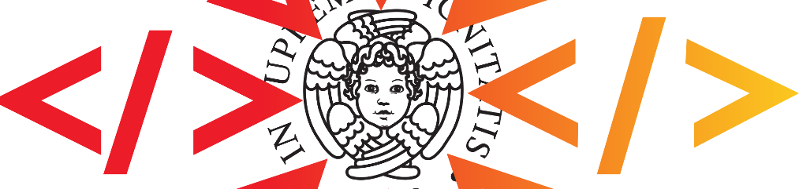

---

  

<!--  -->

---

# SWHAP@PISA

This repository brings together the documentation, the catalogue and other information about the software acquisition process done by [Department of Computer Science](https://di.unipi.it) of [University of Pisa](https://unipi.it) for [Software Heritage](https://www.softwareheritage.org).

**Under contruction**
<!-- 
*We are currently working on the draft of [Working Notepad](DOCS/WorkingNotepad/WorkingNotepad.md).*
moved to DIUNIPI4SWH-NOTES
-->

*Here is the link to the [software acquisition template repository](https://github.com/Unipisa/SWHAP-TEMPLATE).*

You can find the [Catalogue](CATALOGUE.md) of the currently acquired software.

---

- [SWHAP@PISA](#SWHAPPISA)
  - [The Process](#The-Process)
  - [How To Contribute](#How-To-Contribute)
  - [Use cases](#Use-cases)

---

## The Process

_Here a brief description of the process and the process instantiation @ PISA_

For more details see [the process documentation](./DOCS/THE_PROCESS.md)

## How To Contribute
_Here a brief description of how an acquisition can be done_

For more details see [the process documentation](./DOCS/HOWTO.md)

## Use cases

The list of currently acquired softwares can be found in CATALOGUE.md
